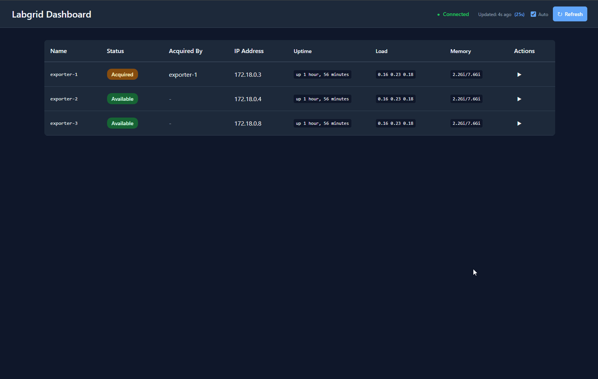

# Labgrid Dashboard

A web-based dashboard for monitoring and interacting with devices (DUTs) managed by a [Labgrid](https://github.com/labgrid-project/labgrid) Coordinator.

## ⚠️ Disclaimer

> **This project is largely developed using AI-assisted "vibe coding".**
>
> While functional, the code may contain patterns, approaches, or implementations that were generated with significant AI assistance. Use in production environments should be done with appropriate review and testing.

## 🎬 Demo



## What is this project?

Labgrid Dashboard provides a real-time web interface to:

- **View all targets** managed by your Labgrid Coordinator in a clean table view
- **Monitor status** - See which devices are available, acquired, or offline
- **Track ownership** - Know who currently has acquired each exporter/target
- **Quick access** - Click on IP addresses to directly access device web interfaces
- **Execute commands** - Run predefined commands on DUTs and view their outputs
- **Hardware Presets** - Assign hardware-specific command sets to different targets
- **Grouped Display** - Targets are automatically grouped by their preset type
- **Real-time updates** - WebSocket-based live status updates without manual refresh

> 📖 For a quick introduction, see the [Quick Start Guide](quick-start.md).

## Technology Stack

| Component | Technology |
|-----------|------------|
| Frontend | React 19 + TypeScript + Vite |
| Backend | Python 3.11+ + FastAPI |
| Real-time | WebSockets |
| Labgrid Communication | gRPC (labgrid 24.0+) |
| Development | Docker Compose |
| Testing | Vitest (Frontend), pytest (Backend) |

## Quick Start

### Prerequisites

- Docker & Docker Compose
- Node.js 20+ (for local development)
- Python 3.11+ (for local development)

## Deployment Modes

### Development Mode (Default)
Starts the full stack (Coordinator, Backend, Frontend) for local development.

```bash
docker compose up -d
```

### Staging Mode
Runs with simulated DUTs (Alpine Linux containers) and real Labgrid Exporters. Commands are executed via `labgrid-client` CLI, which properly routes through: Backend → Coordinator → Exporter → DUT.

```bash
# Start with real command execution
docker compose --profile staging up -d --build
```

**Auto-Acquire Feature:**
When starting in staging mode, an init-container automatically:
1. Creates a place named `exporter-1`
2. Matches it with the exporter-1 resources
3. Acquires the place as `staging-user`

This demonstrates the "acquired" status in the dashboard with:
- `exporter-1`: Status "acquired", acquired_by: "staging-user"
- `exporter-2`, `exporter-3`: Status "available"

**Staging Architecture:**
```
┌─────────────────────────────────────────────────────────────┐
│                     Staging Environment                      │
├─────────────────────────────────────────────────────────────┤
│                                                             │
│  ┌─────────┐   ┌─────────┐   ┌─────────┐                   │
│  │  DUT-1  │   │  DUT-2  │   │  DUT-3  │  (Alpine Linux)   │
│  │ :5000   │   │ :5000   │   │ :5000   │                   │
│  └────┬────┘   └────┬────┘   └────┬────┘                   │
│       │ Serial     │ Serial     │ Serial                   │
│  ┌────▼────┐   ┌────▼────┐   ┌────▼────┐                   │
│  │Exporter1│   │Exporter2│   │Exporter3│  (labgrid)        │
│  └────┬────┘   └────┬────┘   └────┬────┘                   │
│       └──────────┬──┴──────────────┘ gRPC                  │
│            ┌─────▼─────┐                                    │
│            │Coordinator│  (labgrid 24.0+)                  │
│            └─────┬─────┘                                    │
│                  │ labgrid-client CLI                       │
│            ┌─────▼─────┐                                    │
│            │  Backend  │  (FastAPI)                         │
│            └─────┬─────┘                                    │
│                  │ HTTP/WS                                  │
│            ┌─────▼─────┐                                    │
│            │ Frontend  │  (React)                           │
│            └───────────┘                                    │
└─────────────────────────────────────────────────────────────┘
```

**How Command Execution Works:**
1. Frontend sends command request to Backend via HTTP
2. Backend uses `labgrid-client` CLI to execute commands
3. `labgrid-client` communicates with Coordinator via gRPC
4. Coordinator routes to appropriate Exporter
5. Exporter uses the appropriate driver (ShellDriver, SSHDriver, etc.) to execute on DUT
6. Output flows back through the same path

**Supported Connection Types:**
Labgrid automatically selects the appropriate driver based on available resources:
- **NetworkSerialPort** - Serial over TCP (used in staging)
- **USBSerialPort** - Direct USB serial connection
- **SSHDriver** - SSH connection for network-accessible DUTs

## Docker Commands

| Command | Description |
|---------|-------------|
| `docker compose up -d` | Start in development mode |
| `docker compose --profile staging up -d --build` | Start in staging mode (simulated DUTs) |
| `docker compose --profile staging down` | Stop all services |
| `docker compose --profile staging ps` | Show service status |
| `docker compose --profile staging logs -f` | Follow all logs |
| `docker compose --profile staging logs exporter-1` | View specific exporter logs |

### Local Development

**Backend:**

```bash
cd backend
python -m venv venv
source venv/bin/activate
pip install -r requirements.txt
uvicorn app.main:app --reload --port 8000
```

**Frontend:**

```bash
cd frontend
npm install
npm run dev        # Start development server
```

> 📖 See [frontend/README.md](frontend/README.md) for more frontend-specific details.

### Running Tests

**Backend:**

```bash
cd backend
pip install -r requirements.txt  # Includes test dependencies
pytest
```

**Frontend:**

```bash
cd frontend
npm install
npm test              # Run tests once
npm run test:ui       # Run with Vitest UI
npm run test:coverage # Run with coverage report
```

## Configuration

### Hardware Presets (`backend/commands.yaml`)

The dashboard uses a **preset system** to define hardware-specific command sets. Targets are grouped by their assigned preset in the UI, with each preset having its own scheduled command columns.

```yaml
# Default preset for new targets
default_preset: basic

# Preset definitions
presets:
  basic:
    name: "Basic"
    description: "Standard Linux Commands"
    commands:
      - name: "Linux Version"
        command: "cat /etc/os-release"
        description: "Shows the Linux distribution"
      # ... more commands

    # Commands that auto-refresh when a target is expanded
    auto_refresh_commands:
      - "Linux Version"
      - "System Time"

    # Commands shown as table columns (run periodically)
    scheduled_commands:
      - name: "Uptime"
        command: "uptime -p"
        interval_seconds: 60
      - name: "Load"
        command: "cat /proc/loadavg | cut -d' ' -f1-3"
        interval_seconds: 30

  hardware1:
    name: "Hardware 1"
    description: "Commands for specialized hardware"
    commands:
      - name: "Temperature"
        command: "cat /sys/class/thermal/thermal_zone0/temp"
        description: "CPU Temperature"
      # ... hardware-specific commands

    scheduled_commands:
      - name: "Temperature"
        command: "cat /sys/class/thermal/thermal_zone0/temp"
        interval_seconds: 30
```

**Preset Assignment:**
- Targets are assigned to presets via the Settings icon (⚙️) in the expanded target view
- Assignments are stored in `target_presets.json`
- Unassigned targets use the `default_preset`

**Grouped Display:**
- Targets are automatically grouped by preset in the dashboard
- Each group shows preset-specific scheduled command columns
- Empty preset groups are hidden

### Environment Variables

See `.env.example` for the full list of available configuration options.

#### Backend Configuration

| Variable | Description | Default |
|----------|-------------|---------|
| `COORDINATOR_URL` | Labgrid Coordinator gRPC address (host:port or ws://host:port for legacy config) | `coordinator:20408` |
| `COORDINATOR_REALM` | Realm (kept for compatibility, not used in gRPC) | `realm1` |
| `COORDINATOR_TIMEOUT` | Connection timeout in seconds | `30` |
| `COMMANDS_FILE` | Path to commands configuration file | `commands.yaml` |
| `DEBUG` | Enable debug mode | `false` |
| `CORS_ORIGINS` | Allowed CORS origins (comma-separated) | `http://localhost:3000,http://localhost:5173` |

#### Frontend Configuration

See `frontend/.env.example` for frontend-specific variables:

| Variable | Description | Default |
|----------|-------------|---------|
| `VITE_API_URL` | Backend API URL | `http://localhost:8000` |
| `VITE_WS_URL` | Backend WebSocket URL | `ws://localhost:8000/api/ws` |

#### Labgrid CLI Variables (used by init-acquire container)

| Variable | Description | Default |
|----------|-------------|---------|
| `COORDINATOR_HOST` | Labgrid Coordinator address (host:port) | `coordinator:20408` |
| `USER_NAME` | Username shown as "acquired_by" | `staging-user` |
| `PLACE_NAME` | Place name to create and acquire | `exporter-1` |
| `EXPORTER_NAME` | Exporter to match resources from | `exporter-1` |

## API Documentation

When backend is running, visit:

- **Swagger UI**: http://localhost:8000/docs
- **ReDoc**: http://localhost:8000/redoc

### Key Endpoints

| Endpoint | Method | Description |
|----------|--------|-------------|
| `/api/health` | GET | Health check with coordinator status |
| `/api/targets` | GET | List all targets |
| `/api/targets/{name}` | GET | Get specific target details |
| `/api/targets/{name}/commands` | GET | Get available commands for target |
| `/api/targets/{name}/command` | POST | Execute command on target |
| `/api/presets` | GET | List all available presets |
| `/api/presets/{preset_id}` | GET | Get preset details with commands |
| `/api/targets/{name}/preset` | GET | Get current preset for a target |
| `/api/targets/{name}/preset` | PUT | Assign preset to a target |
| `/api/ws` | WebSocket | Real-time updates |

## Architecture

See [plans/architecture-plan.md](plans/architecture-plan.md) for detailed architecture documentation.

### Project Structure

```
labgrid-dashboard/
├── backend/                 # FastAPI backend
│   ├── app/
│   │   ├── api/            # API routes and WebSocket handlers
│   │   │   └── routes/     # Route definitions (health, targets, presets)
│   │   ├── models/         # Pydantic models (Target, Preset, Response)
│   │   └── services/       # Business logic
│   │       ├── labgrid_client.py   # Labgrid Coordinator communication
│   │       ├── command_service.py  # Command execution
│   │       ├── preset_service.py   # Preset management
│   │       └── scheduler_service.py # Scheduled command execution
│   ├── tests/              # Backend tests
│   ├── commands.yaml       # Preset and command definitions
│   └── target_presets.json # Target-to-preset assignments (auto-generated)
├── frontend/               # React frontend
│   ├── src/
│   │   ├── components/     # React components
│   │   │   ├── CommandPanel/     # Command execution UI
│   │   │   ├── TargetTable/      # Target list display (grouped by preset)
│   │   │   ├── TargetSettings/   # Preset selection UI
│   │   │   └── common/           # Shared components
│   │   ├── hooks/          # Custom React hooks
│   │   │   ├── useTargets.ts           # Target data fetching
│   │   │   ├── usePresetsWithTargets.ts # Grouped preset/target data
│   │   │   └── useWebSocket.ts         # Real-time updates
│   │   ├── services/       # API client
│   │   ├── types/          # TypeScript types
│   │   └── __tests__/      # Frontend tests
│   ├── .env.example        # Frontend environment template
│   └── vitest.config.ts    # Test configuration
├── docker/                 # Docker configurations
│   ├── coordinator/        # Labgrid Coordinator
│   ├── dut/                # Simulated DUT containers (Alpine Linux)
│   ├── exporter/           # Labgrid Exporter configuration
│   └── init-acquire/       # Auto-acquire initialization script
├── agent-rules/            # AI agent coding rules
├── plans/                  # Architecture documentation
├── .env.example            # Environment variables template
├── docker-compose.yml      # Docker Compose configuration
└── quick-start.md          # Quick start guide
```

## Troubleshooting

### Staging Mode Issues

**Exporters not connecting:**
```bash
# Check exporter logs
docker compose --profile staging logs exporter-1

# Verify coordinator is healthy
docker compose --profile staging exec coordinator crossbar status
```

**DUT containers not responding:**
```bash
# Test Serial-over-TCP connection manually
docker compose --profile staging exec backend nc dut-1 5000

# Check DUT container logs
docker compose --profile staging logs dut-1
```

**Commands not executing:**
- Verify exporter is registered with coordinator
- Check that DUT container is running: `docker compose --profile staging ps dut-1`

## Contributing

Contributions are welcome! Please feel free to submit issues and pull requests.

Please review the [AGENTS.md](AGENTS.md) and [agent-rules/](agent-rules/) for coding guidelines when contributing.

## License

This project is licensed under the MIT License - see the [LICENSE](LICENSE) file for details.
