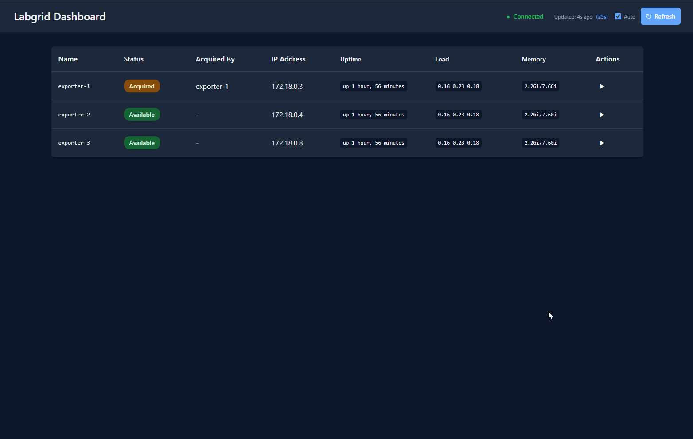

# Labgrid Dashboard

A web-based dashboard for monitoring and interacting with devices (DUTs) managed by a [Labgrid](https://github.com/labgrid-project/labgrid) Coordinator.

## ⚠️ Disclaimer

> **This project is largely developed using AI-assisted "vibe coding".**
>
> While functional, the code may contain patterns, approaches, or implementations that were generated with significant AI assistance. Use in production environments should be done with appropriate review and testing.

## 🎬 Demo



## What is this project?

Labgrid Dashboard provides a real-time web interface to:

- **View all targets** managed by your Labgrid Coordinator in a clean table view
- **Monitor status** - See which devices are available, acquired, or offline
- **Track ownership** - Know who currently has acquired each exporter/target
- **Quick access** - Click on IP addresses to directly access device web interfaces
- **Execute commands** - Run predefined commands on DUTs with serial-first transport, exporter SSH bundles, and SSH fallback
- **Hardware Presets** - Assign hardware-specific command sets to different targets
- **Grouped Display** - Targets are automatically grouped by their preset type
- **Transport-aware UI** - Hide command controls on unsupported targets, show a per-device reason, and surface the transport actually used for each command
- **Real-time updates** - WebSocket-based live status updates without manual refresh

> 📖 For a quick introduction, see the [Quick Start Guide](quick-start.md).

## Technology Stack

| Component | Technology |
|-----------|------------|
| Frontend | React 19 + TypeScript + Vite |
| Backend | Python 3.11+ + FastAPI |
| Real-time | WebSockets |
| Labgrid Communication | gRPC (labgrid 24.0+) |
| Development | Docker Compose |
| Testing | Vitest (Frontend), pytest (Backend) |

## Quick Start

### Prerequisites

- Docker & Docker Compose
- Node.js 20+ (for local development)
- Python 3.11+ (for local development)

## Production Deployment (GHCR Release Image)

> **⚠️ Important**: The production GHCR image is a **single combined container** running nginx + backend on **port 80**, not port 8000. It uses **runtime environment variables**, not `VITE_*` build-time variables.

### Using the Pre-built GHCR Image

**Pull from GitHub Container Registry:**

```bash
# Pull the latest version
docker pull ghcr.io/gerrri/labgrid-dashboard:latest

# Or pin to a specific version (recommended for production)
docker pull ghcr.io/gerrri/labgrid-dashboard:v0.1.4
```

### Quick Start

```bash
docker run -d \
  --name labgrid-dashboard \
  -p 80:80 \
  -e COORDINATOR_URL=ws://your-coordinator:20408/ws \
  -v ./exporter-ssh:/app/exporter-ssh:ro \
  ghcr.io/gerrri/labgrid-dashboard:latest
```

**Access**: http://localhost

### Production Image Architecture

```
┌─────────────────────────────────┐
│  Container (Port 80)            │
│                                 │
│  ┌──────────────────────────┐  │
│  │ Nginx (Port 80)          │  │
│  │ - Serves frontend        │  │
│  │ - Proxies /api → :8000   │  │
│  └──────────┬───────────────┘  │
│             │                   │
│  ┌──────────▼───────────────┐  │
│  │ FastAPI (Port 8000)      │  │
│  │ - Internal only          │  │
│  └──────────────────────────┘  │
│                                 │
│  Managed by Supervisord         │
└─────────────────────────────────┘
```

### Key Differences: Production vs Development

| Aspect | Production (GHCR) | Development (docker-compose) |
|--------|------------------|------------------------------|
| **Port** | `80` (nginx) | `3000` (frontend), `8000` (backend) |
| **Architecture** | Combined (nginx + backend) | Separate containers |
| **Environment Variables** | Runtime (`COORDINATOR_URL`) | Build-time (`VITE_*`) + Runtime |
| **Frontend Config** | Injected via `entrypoint.sh` | Build-time in Vite |
| **Use Case** | Production deployment | Local development |

### Production Environment Variables

The GHCR image uses **runtime configuration** (not build-time):

| Variable | Required | Default | Description |
|----------|----------|---------|-------------|
| `COORDINATOR_URL` | **Yes** | - | Labgrid coordinator URL (e.g., `ws://coordinator:20408/ws`) |
| `CORS_ORIGINS` | No | `http://localhost` | Comma-separated allowed origins |
| `API_URL_EXTERNAL` | No | `/api` | Frontend runtime API base URL |
| `WS_URL_EXTERNAL` | No | `/api/ws` | External WebSocket URL (for reverse proxy scenarios) |
| `DEBUG` | No | `false` | Enable debug logging |

**Note**: `VITE_*` variables are **not used** in the production image. Configuration is injected at runtime via `/env-config.js`.

The frontend normalizes runtime URL settings to avoid malformed paths:
- `API_URL`: `""`, `/`, `/api`, `/api/` all resolve correctly (no `/api/api/*`)
- `WS_URL`: relative and absolute values are normalized to a valid WebSocket URL

### Exporter SSH Bundles

Serial command execution still reaches exporters over SSH. The backend expects an exporter SSH bundle tree at runtime and generates the SSH material it needs from that input.

Runtime input path:

- `/app/exporter-ssh/<exporter-name>/exporter.yaml`
- optional key files in the same exporter directory, such as `/app/exporter-ssh/<exporter-name>/id_ed25519`

Generated runtime SSH material:

- `~/.ssh/config` with an include for the managed exporter config
- `~/.ssh/labgrid-dashboard/config`
- `~/.ssh/labgrid-dashboard/known_hosts`
- `~/.ssh/labgrid-dashboard/keys/<exporter-name>` when a private key is provided

Supported auth modes:

- private key
- username/password

Example bundle layout:

```text
/app/exporter-ssh/
  exporter-1/
    exporter.yaml
    id_ed25519
  exporter-2/
    exporter.yaml
```

### Example: Production with Docker Compose

```yaml
version: '3.8'
services:
  labgrid-dashboard:
    image: ghcr.io/gerrri/labgrid-dashboard:latest
    ports:
      - "80:80"  # Note: Port 80, not 8000!
    environment:
      - COORDINATOR_URL=ws://coordinator:20408/ws
      - CORS_ORIGINS=http://localhost,https://dashboard.example.com
    volumes:
      - ./commands.yaml:/app/commands.yaml:ro
      - ./target_presets.json:/app/target_presets.json:ro
      - ./exporter-ssh:/app/exporter-ssh:ro
    restart: unless-stopped
```

### Complete Documentation

For detailed production deployment including reverse proxy setup, health monitoring, and troubleshooting:

**→ [Production Deployment Guide](docs/DEPLOYMENT.md)**

## Development & Testing Modes

> **Note**: These modes are for **local development and testing only**. For production, use the [GHCR release image](#production-deployment-ghcr-release-image) above.

### Development Mode (Default)
Starts the full stack (Coordinator, Backend, Frontend) for local development with separate containers.

```bash
docker compose up -d
```

**Ports**:
- Frontend: http://localhost:3000
- Backend API: http://localhost:8000

### Staging Mode
Runs with simulated DUTs (Alpine Linux containers) and real Labgrid exporters. Commands prefer a serial shell and still reach exporters over SSH through the exporter bundle configuration. If serial execution is not available for the target/preset, the backend falls back to SSH when the preset allows it.

If the backend starts before the coordinator becomes reachable, it remains available in degraded mode and retries the coordinator connection automatically in the background.

```bash
# Start with real command execution
docker compose --profile staging up -d --build
```

**Ports**: Same as development mode

**Staging Topology:**
The staging profile creates four places and leaves all of them idle by default:

- `exporter-1`: serial-only command execution
- `exporter-2`: serial-first command execution with SSH fallback
- `exporter-3`: SSH command execution using a DUT private key
- `exporter-4`: SSH command execution using DUT username/password

The exporter SSH bundle coverage in staging also exercises both supported exporter auth modes:

- `exporter-1`: exporter reached through a private key bundle
- `exporter-4`: exporter reached through a username/password bundle

After running a command, the UI updates the `Command transport:` label to the transport that was actually used for the latest execution. For example, `exporter-2` switches from `serial` to `ssh` after the SSH fallback path succeeds.

**Staging Architecture:**
```
┌─────────────────────────────────────────────────────────────┐
│                     Staging Environment                      │
├─────────────────────────────────────────────────────────────┤
│                                                             │
│  ┌─────────┐   ┌─────────┐   ┌─────────┐   ┌─────────┐      │
│  │  DUT-1  │   │  DUT-2  │   │  DUT-3  │   │  DUT-4  │      │
│  │ :5000   │   │ :5000   │   │ :5000   │   │ :5000   │      │
│  └────┬────┘   └────┬────┘   └────┬────┘   └────┬────┘      │
│       │ Serial     │ Serial     │ SSH        │ SSH         │
│  ┌────▼────┐   ┌────▼────┐   ┌────▼────┐   ┌────▼────┐      │
│  │Exporter1│   │Exporter2│   │Exporter3│   │Exporter4│      │
│  └────┬────┘   └────┬────┘   └────┬────┘   └────┬────┘      │
│       └─────────────┴─────────────┴─────────────┘ gRPC      │
│            ┌─────▼─────┐                                    │
│            │Coordinator│  (labgrid 24.0+)                  │
│            └─────┬─────┘                                    │
│                  │ labgrid-client CLI                       │
│            ┌─────▼─────┐                                    │
│            │  Backend  │  (FastAPI)                         │
│            └─────┬─────┘                                    │
│                  │ HTTP/WS                                  │
│            ┌─────▼─────┐                                    │
│            │ Frontend  │  (React)                           │
│            └───────────┘                                    │
└─────────────────────────────────────────────────────────────┘
```

**How Command Execution Works:**
1. Frontend sends command request to Backend via HTTP
2. Backend resolves the target's preset and `command_execution` transport order
3. Backend prefers serial execution through Labgrid's `SerialDriver` + `ShellDriver`
4. Serial command execution still reaches the exporter over SSH via the exporter bundle configuration
5. If serial is unavailable or transport setup fails, Backend falls back to the backend-managed `SSHDriver` when SSH is allowed by the preset
6. The frontend shows the transport that was actually used for the latest command result
7. Scheduled commands, REST requests, and WebSocket-triggered commands all use the same backend execution service
8. Output flows back through the same path

**Supported Execution Transports:**
- **Serial shell** - Uses a `NetworkSerialPort` and Labgrid's `ShellDriver`, including login automation and prompt detection
- **Exporter SSH bundles** - Provide exporter host/IP, `known_hosts`, and optional key material for serial transport
- **SSH fallback** - Uses the backend-managed `SSHDriver` when a `NetworkService` is available and the preset allows SSH
- **Unsupported** - If neither transport is available, the backend marks the target as not command-capable and the UI hides command controls for that device

### Command Execution Configuration

Command execution is configured per preset in `backend/commands.yaml`. Each preset can define:

- ordered transport preference
- serial login automation
- shell prompt detection
- serial command timeout overrides

Example:

```yaml
default_preset: basic

presets:
  basic:
    name: "Basic"
    description: "Standard Linux Commands"
    command_execution:
      transport_order:
        - serial
        - ssh
      serial:
        prompt: ".*[#\\$] "
        login_prompt: "(?i)login: ?"
        username: "root"
        password_env: "LABGRID_SERIAL_PASSWORD"
        command_timeout_seconds: 60
```

Notes:

- `transport_order` is evaluated from left to right per target
- `serial.username` / `serial.password` can be set inline, or via `serial.username_env` / `serial.password_env`
- the same transport order is used for manual commands and scheduled commands
- the UI uses backend-provided command capability metadata, so unsupported targets do not show command buttons

## Docker Commands

| Command | Description |
|---------|-------------|
| `docker compose up -d` | Start in development mode |
| `docker compose --profile staging up -d --build` | Start in staging mode (simulated DUTs) |
| `docker compose --profile staging down` | Stop all services |
| `docker compose --profile staging ps` | Show service status |
| `docker compose --profile staging logs -f` | Follow all logs |
| `docker compose --profile staging logs exporter-1` | View specific exporter logs |

### Local Development

**Backend:**

```bash
cd backend
python -m venv venv
source venv/bin/activate
pip install -r requirements.txt
uvicorn app.main:app --reload --port 8000
```

**Frontend:**

```bash
cd frontend
npm install
npm run dev        # Start development server
```

> 📖 See [frontend/README.md](frontend/README.md) for more frontend-specific details.

### Running Tests

**Backend:**

```bash
cd backend
pip install -r requirements.txt  # Includes test dependencies
pytest
```

**Frontend:**

```bash
cd frontend
npm install
npm test              # Run tests once
npm run test:ui       # Run with Vitest UI
npm run test:coverage # Run with coverage report
```

## Configuration

### Hardware Presets (`backend/commands.yaml`)

The dashboard uses a **preset system** to define hardware-specific command sets. Targets are grouped by their assigned preset in the UI, with each preset having its own scheduled command columns.

```yaml
# Default preset for new targets
default_preset: basic

# Preset definitions
presets:
  basic:
    name: "Basic"
    description: "Standard Linux Commands"
    commands:
      - name: "Linux Version"
        command: "cat /etc/os-release"
        description: "Shows the Linux distribution"
      # ... more commands

    # Commands that auto-refresh when a target is expanded
    auto_refresh_commands:
      - "Linux Version"
      - "System Time"

    # Commands shown as table columns (run periodically)
    scheduled_commands:
      - name: "Uptime"
        command: "uptime -p"
        interval_seconds: 60
      - name: "Load"
        command: "cat /proc/loadavg | cut -d' ' -f1-3"
        interval_seconds: 30

  hardware1:
    name: "Hardware 1"
    description: "Commands for specialized hardware"
    commands:
      - name: "Temperature"
        command: "cat /sys/class/thermal/thermal_zone0/temp"
        description: "CPU Temperature"
      # ... hardware-specific commands

    scheduled_commands:
      - name: "Temperature"
        command: "cat /sys/class/thermal/thermal_zone0/temp"
        interval_seconds: 30
```

**Preset Assignment:**
- Targets are assigned to presets via the Settings icon (⚙️) in the expanded target view
- Assignments are stored in `target_presets.json`
- Unassigned targets use the `default_preset`

**Grouped Display:**
- Targets are automatically grouped by preset in the dashboard
- Each group shows preset-specific scheduled command columns
- Empty preset groups are hidden

### Environment Variables

See `.env.example` for the full list of available configuration options.

#### Backend Configuration

| Variable | Description | Default |
|----------|-------------|---------|
| `COORDINATOR_URL` | Labgrid Coordinator gRPC address (host:port or ws://host:port for legacy config) | `coordinator:20408` |
| `COORDINATOR_REALM` | Realm (kept for compatibility, not used in gRPC) | `realm1` |
| `COORDINATOR_TIMEOUT` | Connection timeout in seconds | `30` |
| `LABGRID_COMMAND_TIMEOUT` | Command execution timeout in seconds | `30` |
| `COMMANDS_FILE` | Path to commands configuration file | `commands.yaml` |
| `DEBUG` | Enable debug mode | `false` |
| `CORS_ORIGINS` | Allowed CORS origins (comma-separated) | `http://localhost:3000,http://localhost:5173` |

#### Frontend Configuration (Development Only)

> **⚠️ Note**: These `VITE_*` variables are **only used in development mode**. The production GHCR image uses runtime configuration via `entrypoint.sh` and does not use these variables.

See `frontend/.env.example` for frontend-specific variables:

| Variable | Description | Default |
|----------|-------------|---------|
| `VITE_API_URL` | Backend API URL (dev only) | `http://localhost:8000` |
| `VITE_WS_URL` | Backend WebSocket URL (dev only) | `ws://localhost:8000/api/ws` |

#### Labgrid CLI Variables (used by init-acquire container)

| Variable | Description | Default |
|----------|-------------|---------|
| `COORDINATOR_HOST` | Labgrid Coordinator address (host:port) | `coordinator:20408` |
| `USER_NAME` | Username shown as "acquired_by" | `staging-user` |
| `PLACE_NAME` | Place name to create and acquire | `exporter-1` |
| `EXPORTER_NAME` | Exporter to match resources from | `exporter-1` |

## API Documentation

When backend is running, visit:

- **Swagger UI**: http://localhost:8000/docs
- **ReDoc**: http://localhost:8000/redoc

### Key Endpoints

| Endpoint | Method | Description |
|----------|--------|-------------|
| `/api/health` | GET | Health check with coordinator status |
| `/api/targets` | GET | List all targets |
| `/api/targets/{name}` | GET | Get specific target details |
| `/api/targets/{name}/commands` | GET | Get available commands for target |
| `/api/targets/{name}/command` | POST | Execute command on target |
| `/api/presets` | GET | List all available presets |
| `/api/presets/{preset_id}` | GET | Get preset details with commands |
| `/api/targets/{name}/preset` | GET | Get current preset for a target |
| `/api/targets/{name}/preset` | PUT | Assign preset to a target |
| `/api/ws` | WebSocket | Real-time updates |

## Architecture

See [plans/architecture-plan.md](plans/architecture-plan.md) for detailed architecture documentation.

### Project Structure

```
labgrid-dashboard/
├── backend/                 # FastAPI backend
│   ├── app/
│   │   ├── api/            # API routes and WebSocket handlers
│   │   │   └── routes/     # Route definitions (health, targets, presets)
│   │   ├── models/         # Pydantic models (Target, Preset, Response)
│   │   └── services/       # Business logic
│   │       ├── labgrid_client.py   # Labgrid Coordinator communication
│   │       ├── command_service.py  # Command execution
│   │       ├── preset_service.py   # Preset management
│   │       └── scheduler_service.py # Scheduled command execution
│   ├── tests/              # Backend tests
│   ├── commands.yaml       # Preset and command definitions
│   └── target_presets.json # Target-to-preset assignments (auto-generated)
├── frontend/               # React frontend
│   ├── src/
│   │   ├── components/     # React components
│   │   │   ├── CommandPanel/     # Command execution UI
│   │   │   ├── TargetTable/      # Target list display (grouped by preset)
│   │   │   ├── TargetSettings/   # Preset selection UI
│   │   │   └── common/           # Shared components
│   │   ├── hooks/          # Custom React hooks
│   │   │   ├── useTargets.ts           # Target data fetching
│   │   │   ├── usePresetsWithTargets.ts # Grouped preset/target data
│   │   │   └── useWebSocket.ts         # Real-time updates
│   │   ├── services/       # API client
│   │   ├── types/          # TypeScript types
│   │   └── __tests__/      # Frontend tests
│   ├── .env.example        # Frontend environment template
│   └── vitest.config.ts    # Test configuration
├── docker/                 # Docker configurations
│   ├── coordinator/        # Labgrid Coordinator
│   ├── dut/                # Simulated DUT containers (Alpine Linux)
│   ├── exporter/           # Labgrid Exporter configuration
│   └── init-acquire/       # Auto-acquire initialization script
├── agent-rules/            # AI agent coding rules
├── plans/                  # Architecture documentation
├── .env.example            # Environment variables template
├── docker-compose.yml      # Docker Compose configuration
└── quick-start.md          # Quick start guide
```

## Troubleshooting

### Staging Mode Issues

**Exporters not connecting:**
```bash
# Check exporter logs
docker compose --profile staging logs exporter-1

# Verify coordinator is healthy
docker compose --profile staging exec coordinator crossbar status
```

**DUT containers not responding:**
```bash
# Test Serial-over-TCP connection manually
docker compose --profile staging exec backend nc dut-1 5000

# Check DUT container logs
docker compose --profile staging logs dut-1
```

**Commands not executing:**
- Verify exporter is registered with coordinator
- Check that DUT container is running: `docker compose --profile staging ps dut-1`

## Contributing

Contributions are welcome! Please feel free to submit issues and pull requests.

Please review the [AGENTS.md](AGENTS.md) and [agent-rules/](agent-rules/) for coding guidelines when contributing.

## License

This project is licensed under the MIT License - see the [LICENSE](LICENSE) file for details.
 free to submit issues and pull requests.

Please review the [AGENTS.md](AGENTS.md) and [agent-rules/](agent-rules/) for coding guidelines when contributing.

## License

This project is licensed under the MIT License - see the [LICENSE](LICENSE) file for details.
