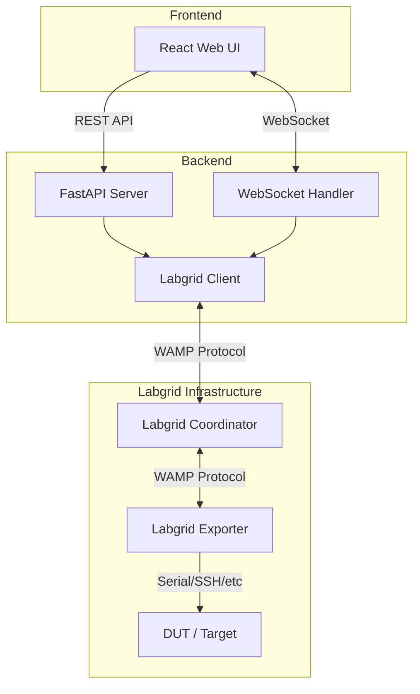
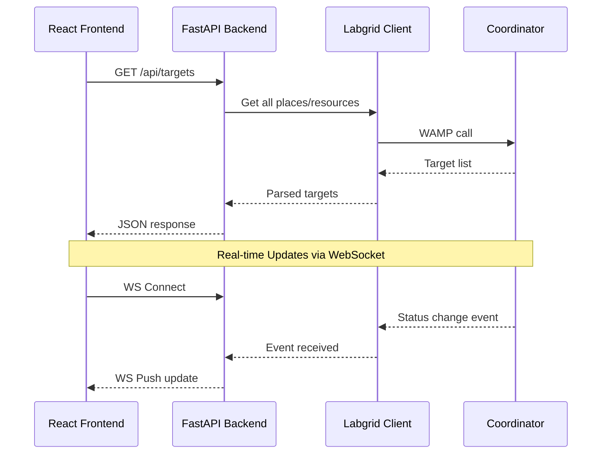

# Labgrid Dashboard - Architecture Plan

## Overview

A web-based dashboard to monitor and interact with devices (DUTs) managed by a Labgrid Coordinator.

## Technology Stack

| Component | Technology | Rationale |
|-----------|------------|-----------|
| Frontend | React + TypeScript | User preference, strong ecosystem |
| Backend | Python + FastAPI | Native Labgrid integration, async support, WebSockets |
| Real-time | WebSockets | Live status updates |
| Labgrid Communication | WAMP via autobahn | Labgrid uses Crossbar.io/WAMP internally |
| Development DB | SQLite | Simple, no setup needed |
| Testing | Docker + Mock Targets | No real hardware needed |

## System Architecture



## Data Flow



## API Design

### REST Endpoints

| Method | Endpoint | Description |
|--------|----------|-------------|
| GET | /api/targets | List all targets with status |
| GET | /api/targets/{name} | Get single target details |
| POST | /api/targets/{name}/command | Execute command on DUT |
| GET | /api/targets/{name}/commands | Get command history/outputs |
| GET | /api/health | Backend health check |

### WebSocket Events

| Event | Direction | Payload |
|-------|-----------|---------|
| target_update | Server→Client | Updated target object |
| command_output | Server→Client | Command execution result |
| subscribe | Client→Server | Subscribe to target updates |

## Frontend Components

```
src/
├── components/
│   ├── TargetTable/          # Main table view
│   │   ├── TargetTable.tsx
│   │   ├── TargetRow.tsx
│   │   └── StatusBadge.tsx
│   ├── CommandOutput/        # Command output display
│   │   ├── CommandPanel.tsx
│   │   └── OutputViewer.tsx
│   └── common/
│       ├── Header.tsx
│       └── Loading.tsx
├── hooks/
│   ├── useTargets.ts         # Target data fetching
│   └── useWebSocket.ts       # WebSocket connection
├── services/
│   ├── api.ts                # REST API client
│   └── websocket.ts          # WebSocket client
├── types/
│   └── index.ts              # TypeScript types
└── App.tsx
```

## Backend Structure

```
backend/
├── app/
│   ├── main.py               # FastAPI app entry
│   ├── api/
│   │   ├── routes/
│   │   │   ├── targets.py    # Target endpoints
│   │   │   └── health.py     # Health check
│   │   └── websocket.py      # WebSocket handler
│   ├── services/
│   │   ├── labgrid_client.py # Labgrid WAMP client
│   │   └── command_executor.py
│   ├── models/
│   │   └── target.py         # Pydantic models
│   └── config.py             # Configuration
├── tests/
│   └── ...
├── requirements.txt
└── Dockerfile
```

## Development Environment

### Docker Compose Setup

```yaml
services:
  coordinator:
    image: labgrid-coordinator  # We need to build/find this
    ports:
      - "20408:20408"
    
  exporter:
    image: labgrid-exporter     # Mock exporter for testing
    depends_on:
      - coordinator
    
  backend:
    build: ./backend
    ports:
      - "8000:8000"
    depends_on:
      - coordinator
    
  frontend:
    build: ./frontend
    ports:
      - "3000:3000"
    depends_on:
      - backend
```

## Target Data Model

```typescript
interface Target {
  name: string;
  status: 'available' | 'acquired' | 'offline';
  acquired_by?: string;      // User who acquired the exporter/target
  ip_address?: string;
  web_url?: string;          // Link to device web interface if available
  resources: Resource[];
  last_command_outputs: CommandOutput[];
}

interface Resource {
  type: string;  // e.g., 'NetworkSerialPort', 'USBSerialPort'
  params: Record<string, any>;
}

interface CommandOutput {
  command: string;
  output: string;
  timestamp: string;
  exit_code: number;
}
```

## Command Configuration

Commands are defined in a YAML configuration file. No free-text input allowed for security reasons.

**Example `commands.yaml`:**

```yaml
# Predefined commands that can be executed on DUTs
commands:
  - name: "Linux Version"
    command: "cat /etc/os-release"
    description: "Shows the Linux distribution"
    
  - name: "System Time"
    command: "date"
    description: "Current system time"
    
  - name: "Kernel Version"
    command: "uname -a"
    description: "Kernel and system info"
    
  - name: "Uptime"
    command: "uptime"
    description: "System uptime"
    
  - name: "Memory Usage"
    command: "free -h"
    description: "RAM usage"

# Commands executed automatically on page load/refresh
auto_refresh_commands:
  - "Linux Version"
  - "System Time"
```

## Command Execution Behavior

- **On Page Load**: Auto-refresh commands are executed for all available targets
- **Periodic Refresh**: Configurable interval (default: 30 seconds)
- **On-Demand**: User can click a button to execute specific commands

## Decisions Made

| Decision | Choice | Rationale |
|----------|--------|-----------|
| Command Configuration | YAML config file | Security, central management |
| Command Execution | Auto on load + periodic + button | Balance of freshness and control |
| Project Structure | Monorepo | Simpler development, shared types |
| Authentication | None | Internal use only |

## UI Display Requirements

The table should display:
- **Target Name**: Identifier of the target
- **Status**: Available / Acquired / Offline (with color coding)
- **Acquired By**: Username of the person who acquired the exporter (if acquired)
- **IP Address**: With clickable link to device web interface (if available)
- **Command Outputs**: Expandable section showing outputs from predefined commands

## Next Steps

1. Set up project structure (monorepo with frontend/backend folders)
2. Create Docker Compose for Labgrid Coordinator + Mock Exporter
3. Implement basic FastAPI backend with Labgrid connection
4. Create React frontend with target table
5. Add WebSocket for real-time updates
6. Implement command execution feature
6. Implement command execution feature
