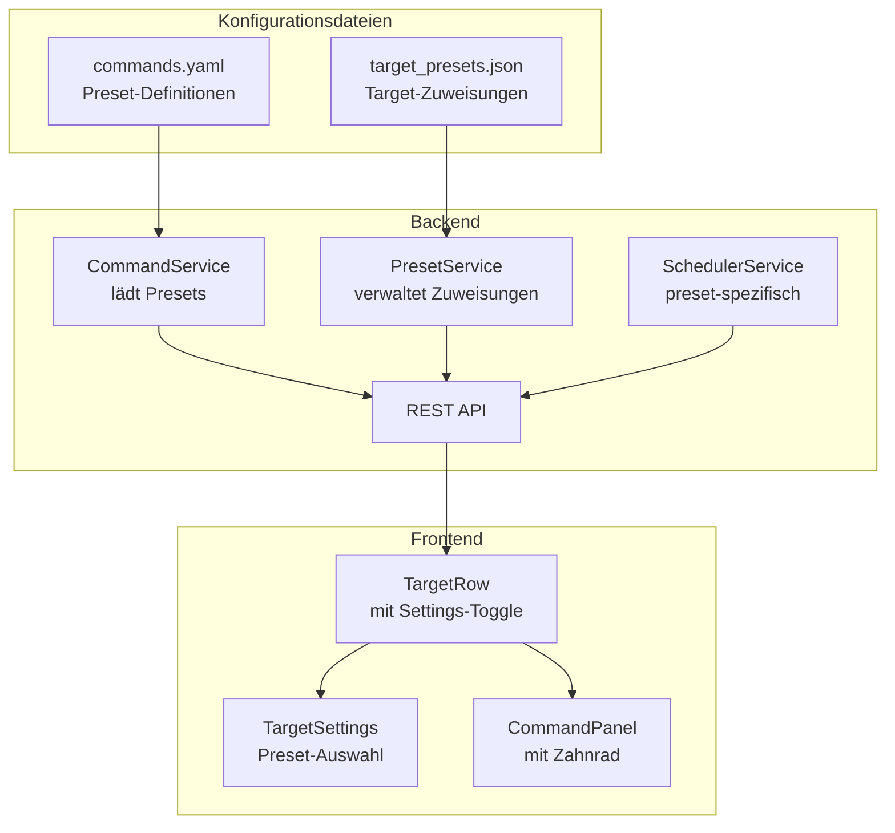

# Hardware Presets Feature - Implementierungsplan

## Übersicht

Implementierung eines Preset-Systems für Hardware-spezifische Commands im Labgrid Dashboard.

### Anforderungen
- **Pro Target**: Jedes Target kann ein eigenes Preset haben
- **Persistenz**: Target→Preset Zuweisungen werden in JSON gespeichert
- **Scheduled Commands**: Auch pro Preset definierbar
- **Default Preset**: "basic" mit den aktuellen Commands
- **UI**: Zahnrad-Button öffnet Settings-View (ersetzt Content, kein Modal)

## Architektur



## YAML-Struktur (commands.yaml)

```yaml
# Default preset für neue Targets
default_preset: basic

# Preset-Definitionen
presets:
  basic:
    name: "Basic"
    description: "Standard Linux Commands"
    commands:
      - name: "Linux Version"
        command: "cat /etc/os-release"
        description: "Shows the Linux distribution"
      - name: "System Time"
        command: "date"
        description: "Current system time"
      - name: "Kernel Version"
        command: "uname -a"
        description: "Kernel and system info"
    scheduled_commands:
      - name: "Uptime"
        command: "uptime -p"
        interval_seconds: 60
        description: "System uptime"
      - name: "Load"
        command: "cat /proc/loadavg | cut -d' ' -f1-3"
        interval_seconds: 30
        description: "System load average"
    auto_refresh_commands:
      - "Linux Version"
      - "System Time"

  hardware1:
    name: "Hardware 1"
    description: "Commands für spezielle Hardware"
    commands:
      - name: "GPIO Status"
        command: "cat /sys/class/gpio/export"
        description: "GPIO Pin Status"
      - name: "I2C Devices"
        command: "i2cdetect -y 1"
        description: "I2C Bus Scan"
      - name: "Temperature"
        command: "cat /sys/class/thermal/thermal_zone0/temp"
        description: "CPU Temperature"
    scheduled_commands:
      - name: "Temperature"
        command: "cat /sys/class/thermal/thermal_zone0/temp"
        interval_seconds: 30
        description: "CPU Temperature monitoring"
    auto_refresh_commands:
      - "GPIO Status"
```

## Target-Zuweisungen (target_presets.json)

```json
{
  "assignments": {
    "dut-1": "hardware1",
    "dut-2": "basic"
  }
}
```

## API-Endpoints

| Endpoint | Methode | Beschreibung |
|----------|---------|--------------|
| `/api/presets` | GET | Liste aller verfügbaren Presets |
| `/api/targets/{name}/preset` | GET | Aktuelles Preset eines Targets |
| `/api/targets/{name}/preset` | PUT | Preset für Target setzen |

## UI-Mockups

### Normalansicht (nach dem Aufklappen)

```
┌─────────────────────────────────────────────────────────────────────┐
│ Target: dut-1                                                       │
├─────────────────────────────────────────────────────────────────────┤
│ Resources (2)                                                       │
│   • NetworkSerialPort                                               │
│   • USBSerialPort                                                   │
│                                                                     │
│ Commands for dut-1                                    [Clear]       │
│ ┌──────────────────┐ ┌──────────────────┐ ┌──────────────────┐     │
│ │  Linux Version   │ │   System Time    │ │  Kernel Version  │     │
│ └──────────────────┘ └──────────────────┘ └──────────────────┘     │
│                                                                     │
│ [Output Bereich...]                                                 │
│                                                           ⚙️        │
└─────────────────────────────────────────────────────────────────────┘
```

### Einstellungs-Ansicht (nach Klick auf ⚙️)

```
┌─────────────────────────────────────────────────────────────────────┐
│ Target: dut-1                                                       │
├─────────────────────────────────────────────────────────────────────┤
│ ┌─────────────────────────────────────────────────────────────────┐ │
│ │  ⚙️ Target Settings                                             │ │
│ │ ───────────────────────────────────────────────────────────── │ │
│ │                                                                 │ │
│ │  Hardware Preset:                                               │ │
│ │  ┌─────────────────────────────────────────────────────────┐   │ │
│ │  │ ○ Basic - Standard Linux Commands                       │   │ │
│ │  │ ● Hardware 1 - Commands für spezielle Hardware          │   │ │
│ │  │ ○ Hardware 2 - Andere Hardware                          │   │ │
│ │  └─────────────────────────────────────────────────────────┘   │ │
│ │                                                                 │ │
│ │  Aktuelle Commands in diesem Preset:                            │ │
│ │  • GPIO Status                                                  │ │
│ │  • I2C Devices                                                  │ │
│ │  • Temperature                                                  │ │
│ │                                                                 │ │
│ │                              [Abbrechen]  [💾 Speichern]        │ │
│ └─────────────────────────────────────────────────────────────────┘ │
└─────────────────────────────────────────────────────────────────────┘
```

## Implementierungsschritte

### Backend Tasks

1. **commands.yaml zur Preset-Struktur umbauen**
   - Aktuelle Commands in "basic" Preset verschieben
   - Preset-Struktur mit name, description, commands, scheduled_commands, auto_refresh_commands

2. **Neue Pydantic Models erstellen** (`backend/app/models/target.py`)
   - `Preset` Model
   - `PresetDetail` Model
   - `PresetsConfig` Model

3. **PresetService implementieren** (`backend/app/services/preset_service.py`)
   - Laden/Speichern von target_presets.json
   - get_target_preset(target_name) -> preset_id
   - set_target_preset(target_name, preset_id)

4. **CommandService refactoren** (`backend/app/services/command_service.py`)
   - get_presets() -> List[Preset]
   - get_preset(preset_id) -> PresetDetail
   - get_commands_for_preset(preset_id) -> List[Command]

5. **SchedulerService anpassen** (`backend/app/services/scheduler_service.py`)
   - Preset-spezifische scheduled_commands berücksichtigen

6. **Neue API-Endpoints** (`backend/app/api/routes/targets.py`)
   - GET /api/presets
   - GET /api/targets/{name}/preset
   - PUT /api/targets/{name}/preset

### Frontend Tasks

7. **TypeScript Types erweitern** (`frontend/src/types/index.ts`)
   - Preset, PresetDetail, PresetsResponse interfaces

8. **API-Service erweitern** (`frontend/src/services/api.ts`)
   - getPresets()
   - getTargetPreset(name)
   - setTargetPreset(name, presetId)

9. **TargetSettings Komponente** (`frontend/src/components/TargetSettings/`)
   - TargetSettings.tsx
   - TargetSettings.css
   - PresetOption.tsx

10. **TargetRow mit Settings-Toggle** (`frontend/src/components/TargetTable/TargetRow.tsx`)
    - showSettings State
    - Toggle zwischen CommandView und SettingsView

11. **CommandPanel mit Zahnrad** (`frontend/src/components/CommandPanel/CommandPanel.tsx`)
    - Zahnrad-Button rechts unten
    - onSettingsClick callback

### Testing

12. **Tests schreiben**
    - Backend: test_preset_service.py, test_command_service_presets.py
    - Frontend: TargetSettings.test.tsx

## Dateien-Übersicht

### Neue Dateien
- `backend/target_presets.json`
- `backend/app/services/preset_service.py`
- `frontend/src/components/TargetSettings/index.ts`
- `frontend/src/components/TargetSettings/TargetSettings.tsx`
- `frontend/src/components/TargetSettings/TargetSettings.css`
- `frontend/src/components/TargetSettings/PresetOption.tsx`

### Geänderte Dateien
- `backend/commands.yaml`
- `backend/app/models/target.py`
- `backend/app/services/command_service.py`
- `backend/app/services/scheduler_service.py`
- `backend/app/api/routes/targets.py`
- `frontend/src/types/index.ts`
- `frontend/src/services/api.ts`
- `frontend/src/components/TargetTable/TargetRow.tsx`
- `frontend/src/components/CommandPanel/CommandPanel.tsx`
