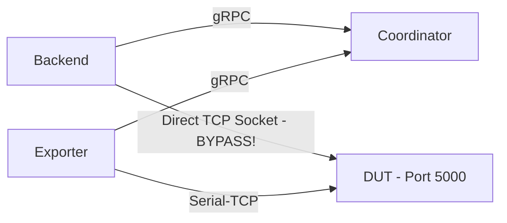
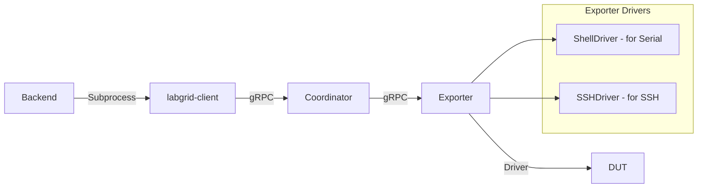

# Multi-Connection-Types Feature Plan

## Final Decision: Labgrid CLI-Based Architecture

This document describes the implementation plan for proper Labgrid integration where **all DUT connections go through the Exporter** using the `labgrid-client` CLI.

### Current Architecture (Problem)



**Problems with current approach**:
1. Backend connects directly to DUT, bypassing Exporter
2. Only works for NetworkSerialPort in same network
3. Cannot support USB Serial, SSH through Exporter
4. Not how Labgrid is designed to work

### Target Architecture



**Benefits**:
1. All connections properly routed through Labgrid
2. Automatic driver selection based on resources
3. Supports all Labgrid resource types out of the box
4. Proper place/resource acquisition handling

---

## Implementation Plan

### Phase 1: Understanding Labgrid CLI

The `labgrid-client` provides these relevant commands:

```bash
# Run a command on the console (uses ShellDriver)
labgrid-client -p <place> -x <coordinator> console --command "uptime"

# Interactive console
labgrid-client -p <place> -x <coordinator> console

# Run command via SSH (if SSHDriver available)
labgrid-client -p <place> -x <coordinator> ssh -- "uptime"
```

**Key insight**: Labgrid handles driver selection automatically based on available resources!

### Phase 2: Refactor LabgridClient

Replace `_execute_via_serial()` with `_execute_via_labgrid_client()`:

```python
# backend/app/services/labgrid_client.py

async def execute_command(self, place_name: str, command: str) -> Tuple[str, int]:
    """Execute a command on a target via labgrid-client.

    This properly routes through: Backend -> Coordinator -> Exporter -> DUT
    """
    try:
        # Use labgrid-client to execute command
        # The -x flag specifies the coordinator address
        proc = await asyncio.create_subprocess_exec(
            "labgrid-client",
            "-p", place_name,
            "-x", self._url,
            "console",
            "--command", command,
            stdout=asyncio.subprocess.PIPE,
            stderr=asyncio.subprocess.PIPE,
        )

        try:
            stdout, stderr = await asyncio.wait_for(
                proc.communicate(),
                timeout=COMMAND_TIMEOUT
            )
        except asyncio.TimeoutError:
            proc.kill()
            return (f"Error: Command timeout after {COMMAND_TIMEOUT}s", 1)

        output = stdout.decode("utf-8", errors="replace")

        if proc.returncode != 0:
            error = stderr.decode("utf-8", errors="replace")
            return (f"Error: {error}" if error else output, proc.returncode)

        return (output.strip(), 0)

    except FileNotFoundError:
        return ("Error: labgrid-client not found. Is labgrid installed?", 1)
    except Exception as e:
        return (f"Error: {str(e)}", 1)
```

### Phase 3: Place Configuration Requirements

For `labgrid-client` to work, we need proper **Place** configuration. Currently our staging setup only has exporters, not places.

#### Current exporter-config.yaml
```yaml
exporter-1:
  NetworkSerialPort:
    host: "dut-1"
    port: 5000
    speed: 115200
```

#### Required: Place configuration in Coordinator
```yaml
# coordinator.yaml or via labgrid-client commands
places:
  dut-1:
    matches:
      - exporter: exporter-1
        group: exporter-1
        cls: NetworkSerialPort
```

### Phase 4: Update Staging Environment

#### Option A: Auto-create places for exporters

Update `init-acquire` container to create places for each exporter:

```bash
#!/bin/bash
# docker/init-acquire/acquire-exporter.sh

# Wait for coordinator
sleep 5

# For each exporter, create a place
for i in 1 2 3; do
    PLACE_NAME="dut-${i}"
    EXPORTER_NAME="exporter-${i}"

    # Create place
    labgrid-client -x $COORDINATOR_HOST create $PLACE_NAME

    # Add resource match
    labgrid-client -x $COORDINATOR_HOST -p $PLACE_NAME add-match "${EXPORTER_NAME}/*"

    # Optionally acquire
    if [ "$i" == "1" ]; then
        labgrid-client -x $COORDINATOR_HOST -p $PLACE_NAME acquire
    fi
done
```

#### Option B: Direct exporter resource usage

Labgrid allows accessing resources directly by exporter name. We can use:
```bash
labgrid-client -x coordinator:20408 -p exporter-1 console --command "uptime"
```

This requires the place name to match the exporter name.

### Phase 5: Backend Changes Summary

#### Files to Modify

1. **`backend/app/services/labgrid_client.py`**
   - Remove `_execute_via_serial()` method
   - Replace with `_execute_via_labgrid_client()` method
   - Update `execute_command()` to use new method
   - Remove socket-based serial code

2. **`backend/Dockerfile`**
   - Ensure `labgrid` package includes CLI tools
   - Already have `labgrid>=24.0` in requirements.txt ✓

3. **`docker/init-acquire/acquire-exporter.sh`**
   - Create places for all exporters
   - Set up resource matches

#### Files to Remove/Cleanup

- Remove `_parse_serial_output()` (not needed, labgrid handles it)
- Remove socket imports if no longer used

### Phase 6: Frontend Cleanup - Remove Connection Type Display

Since Labgrid now handles driver selection automatically, we don't need to display connection types in the UI. Remove the Connection Type section from TargetRow.tsx.

**Files to modify:**
- `frontend/src/components/TargetTable/TargetRow.tsx` - Remove Connection Type toggle and resources list
- `frontend/src/types/index.ts` - Consider removing `resources` from Target type (optional)

**Code to remove from TargetRow.tsx (lines ~249-281):**
- The "Connection Type" button and toggle
- The resources list display
- The `resourcesExpanded` state variable

### Phase 7: Future Enhancements

1. **Interactive console**: WebSocket-based terminal for interactive shell
2. **Power control**: Integrate `labgrid-client power` commands
3. **SSH command execution**: Use `labgrid-client ssh` when SSHDriver available

---

## Git Workflow

All changes will be made on a dedicated feature branch:

```bash
# Create feature branch from main
git checkout main
git pull origin main
git checkout -b feature/labgrid-cli-integration
```

Branch name: `feature/labgrid-cli-integration`

After implementation:
- Run all tests
- Create PR to main
- Delete plan file before merging

---

## Detailed Task Breakdown

### Git Setup (First Task)

- [ ] **Task 0**: Create feature branch from main
  - `git checkout main && git pull`
  - `git checkout -b feature/labgrid-cli-integration`

### Backend Tasks

- [ ] **Task 1**: Remove direct socket connection code from `labgrid_client.py`
  - Remove `_execute_via_serial()` method
  - Remove `_parse_serial_output()` method
  - Remove socket imports
- [ ] **Task 2**: Implement `_execute_via_labgrid_client()` method
  - Use asyncio.create_subprocess_exec
  - Handle timeouts and errors
  - Parse labgrid-client output
- [ ] **Task 3**: Update `execute_command()` to use labgrid-client
- [ ] **Task 4**: Update tests for new execution method
  - Mock subprocess calls
  - Test error handling

### Docker/Infrastructure Tasks

- [ ] **Task 5**: Update `init-acquire` to create places for exporters
  - Create place for each exporter
  - Set up resource matches
- [ ] **Task 6**: Verify labgrid-client works in backend container
  - Test CLI directly in container

### Frontend Tasks

- [ ] **Task 7**: Remove Connection Type section from `TargetRow.tsx`
  - Remove `resourcesExpanded` state
  - Remove Connection Type button and toggle
  - Remove resources list display
- [ ] **Task 8**: Clean up types if resources no longer needed (optional)

### Documentation Tasks

- [ ] **Task 9**: Update README with new architecture
- [ ] **Task 10**: Update architecture diagram in docs

---

## Testing Strategy

### Unit Tests
- Mock subprocess calls to labgrid-client
- Test command parsing and error handling
- Test connection type detection

### Integration Tests
- Test full flow: Backend -> labgrid-client -> Coordinator -> Exporter -> DUT
- Test with staging environment

### Manual Tests
```bash
# Test labgrid-client directly in backend container
docker compose --profile staging exec backend \
    labgrid-client -x coordinator:20408 -p exporter-1 console --command "uptime"
```

---

## Rollback Plan

If issues arise:
1. Keep old `_execute_via_serial()` method as fallback
2. Add config flag to switch between direct socket and labgrid-client
3. Gradually migrate once stable

---

## Questions Resolved

1. ✅ **How to get shell info from coordinator?** - Resources contain connection params, labgrid-client handles driver selection
2. ✅ **Multiple connection types?** - labgrid-client auto-selects, can add manual selection later
3. ✅ **Exporter bypass?** - Eliminated by using labgrid-client

## Open Questions

1. Should we support manual connection type selection in UI?
2. Do we need interactive console support (WebSocket terminal)?
3. How to handle long-running commands?
